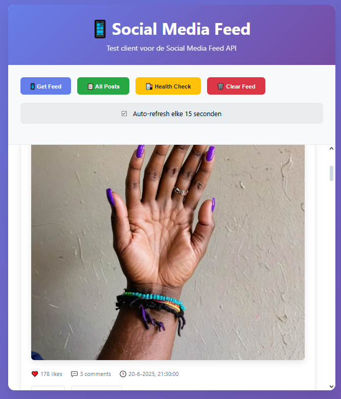

# Social Media Feed API

A Node.js + Express social media feed API that provides a curated feed experience with posts, likes, and comments functionality. The API serves one post at a time, intelligently mixing content from followed users with trending, urgent, and unpopular posts.

## Features

- **Smart Feed Algorithm**: Mixes posts from followed users with trending, urgent, and unpopular content
- **Interactive Posts**: Like and comment on posts with real-time updates
- **Static File Serving**: Serves images directly from the server
- **CORS Enabled**: Configured for cross-origin requests from frontend applications
- **RESTful API**: Clean, intuitive endpoints for all operations
- **In-Memory Data**: Fast response times with in-memory post storage

## Quick Start

### Prerequisites

- Node.js (v14 or higher)
- npm or yarn

### Installation

1. **Clone the repository**
   ```bash
   git clone https://github.com/LHYEjoo/Social-API.git
   cd Social-API
   ```

2. **Install dependencies**
   ```bash
   npm install
   ```

3. **Start the development server**
   ```bash
   npm run dev
   ```

4. **Start the production server**
   ```bash
   npm start
   ```

The API will be available at `http://localhost:3000`

## API Endpoints

### Get Feed Post
```http
GET /feed
```
Returns one post at a time based on the smart feed algorithm.

**Response:**
```json
{
  "success": true,
  "data": {
    "id": 1,
    "personage": "Emily",
    "content": "Post content...",
    "image": "/img/EMI_1.png",
    "likes": 342,
    "comments": [...],
    "urgent": false,
    "timestamp": "2025-06-20T20:40:00Z",
    "type": "trending"
  },
  "message": "Post retrieved successfully"
}
```

### Like a Post
```http
POST /like/:postId
```
Increments the like count for a specific post.

**Response:**
```json
{
  "success": true,
  "data": {
    "postId": 1,
    "likes": 343
  },
  "message": "Post liked successfully"
}
```

### Add Comment
```http
POST /comment/:postId
Content-Type: application/json

{
  "user": "Username",
  "text": "Comment text"
}
```
Adds a comment to a specific post.

**Response:**
```json
{
  "success": true,
  "data": {
    "id": 1234567890,
    "user": "Username",
    "text": "Comment text",
    "timestamp": "2025-06-20T20:45:00Z"
  },
  "message": "Comment added successfully"
}
```

### Get All Posts
```http
GET /posts
```
Returns all posts (useful for debugging/testing).

### Get Specific Post
```http
GET /posts/:id
```
Returns a specific post by ID.

### Health Check
```http
GET /health
```
Returns server health status.

## Project Structure

```
Social-API/
├── data/
│   └── posts.js          # In-memory post data
├── public/
│   ├── img/              # Static images
│   │   ├── EMI_1.png
│   │   ├── EMI_2.png
│   │   └── ...
│   └── index.html        # Frontend client
├── server.js             # Main Express server
├── package.json          # Dependencies and scripts
├── vercel.json           # Vercel deployment config
└── README.md            # This file
```

## Configuration

### Environment Variables

- `PORT`: Server port (default: 3000)

### CORS Configuration

The API is configured with aggressive CORS settings to allow cross-origin requests:

```javascript
// Allows all origins
res.header('Access-Control-Allow-Origin', '*');

// Allows specific methods
res.header('Access-Control-Allow-Methods', 'GET, POST, PUT, DELETE, OPTIONS');

// Allows specific headers
res.header('Access-Control-Allow-Headers', 'Origin, X-Requested-With, Content-Type, Accept, Authorization');
```

## Deployment

### Render (Backend)
The API is deployed on Render. The deployment automatically:
- Detects Node.js project
- Installs dependencies
- Runs `npm start` command

### Vercel (Frontend)
The frontend is deployed on Vercel with the following configuration in `vercel.json`:
- Serves static files from `public/` directory
- Routes all requests to `index.html` for SPA behavior

## Testing

### Using the Test Client
1. Start the server: `npm run dev`
2. Open `http://localhost:3000` in your browser
3. Use the interactive interface to test the API

### API Testing with curl

```bash
# Get a feed post
curl http://localhost:3000/feed

# Like a post
curl -X POST http://localhost:3000/like/1

# Add a comment
curl -X POST http://localhost:3000/comment/1 \
  -H "Content-Type: application/json" \
  -d '{"user": "TestUser", "text": "Great post!"}'

# Get all posts
curl http://localhost:3000/posts
```

## Contributing

1. Fork the repository
2. Create a feature branch: `git checkout -b feature/amazing-feature`
3. Commit your changes: `git commit -m 'Add amazing feature'`
4. Push to the branch: `git push origin feature/amazing-feature`
5. Open a Pull Request

### Development Guidelines
- Follow existing code style
- Add comments for complex logic
- Test your changes thoroughly
- Update documentation if needed

## Troubleshooting

### Common Issues

**CORS Errors**
- Ensure the frontend URL is properly configured in CORS settings
- Check that the API is running and accessible

**Images Not Loading**
- Verify images exist in `public/img/` directory
- Check that static file serving is enabled
- Ensure image paths in posts data are correct

**Port Already in Use**
```bash
# Kill process using port 3000
npx kill-port 3000
# Or use a different port
PORT=3001 npm start
```

**Deployment Issues**
- Check Render logs for deployment errors
- Verify `package.json` has correct start script
- Ensure all dependencies are listed in `package.json`

## Changelog

### Version 1.0.0
- Initial release
- Basic feed functionality
- Like and comment features
- Static file serving
- CORS configuration
- Deployment setup for Render and Vercel

## License

This project is open source and licensed under the MIT License

## Authors

- **LHYEjoo** - *Initial work* - [GitHub](https://github.com/LHYEjoo)

## Acknowledgments

- Express.js team for the excellent web framework
- Render for hosting the backend API
- Vercel for hosting the frontend
- All contributors and testers
